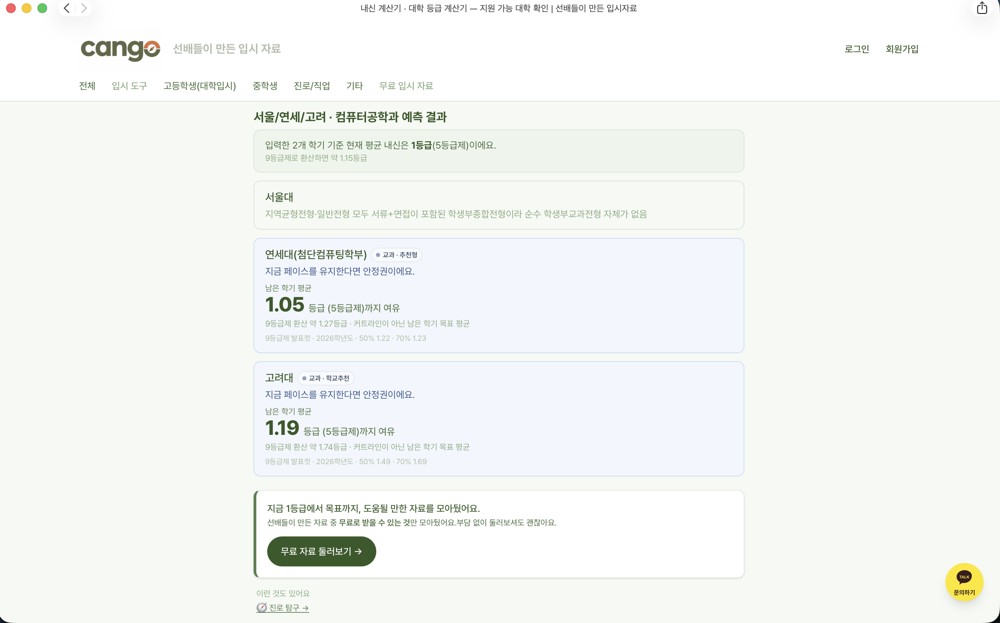
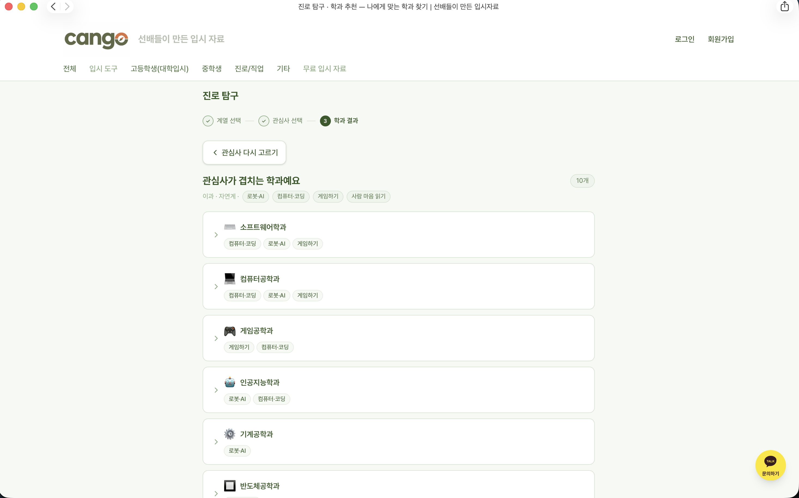
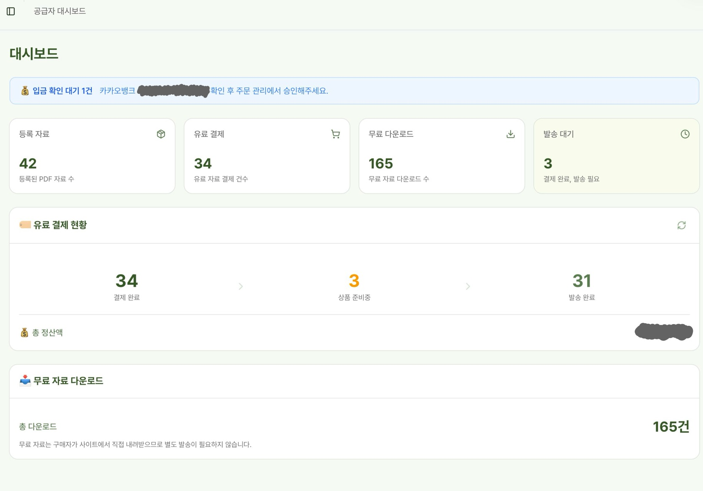

# CANGO — 선배들이 만든 입시자료

고등학생·수험생을 위한 입시 서비스입니다. 선배들이 만든 자료를 사고파는 마켓플레이스에서 시작해 지금은 **내신 등급 역산 계산기**, **진로 탐구**, **원서 조준 테스트** 같은 입시 도구를 함께 운영합니다.

**🔗 https://www.cango.kr** · 2026.04 ~ 현재 운영 중 · 실제 결제·정산·자료 발송이 도는 서비스입니다.

**개발 · 데이터 구축 · 운영 · 고객 응대를 맡았습니다.** 2인 공동창업이고 마케팅은 공동창업자가, **무엇을 만들지는 함께** 정합니다. **프론트엔드 · 백엔드 · 데이터베이스와 데이터에 관한 결정은 제 몫입니다.** 코드는 AI 코딩 도구로 작성했고 이 문서는 제가 근거를 대고 결정에 이르게 한 판단을 중심으로 씁니다.

---

## 화면

**내신 등급 역산 계산기** — 지금 성적을 넣으면 목표 대학까지 "남은 학기에 몇 등급이 필요한지"가 나옵니다.



**진로 탐구** — 계열과 관심사를 고르면 겹치는 학과를 보여주고 내신 계산기에 있는 학과로 이어집니다.



**공급자 대시보드** — 자료 등록부터 입금 확인·발송·정산까지 운영에 필요한 화면을 직접 만들어 씁니다.



---

## 제품을 어떻게 판단했나

기능을 만든 것보다, **근거를 대고 방향을 정하고 틀렸을 때 되돌린 기록**이 더 정확한 제 모습입니다. 제품 기획은 공동창업자와 함께 하고 아래는 그중 제가 근거를 만들어 결정에 이르게 한 것들입니다.

### 자료를 파는 사이트에 왜 계산기를 붙였나

자료 마켓만으로는 **사람이 올 이유가 없었습니다.** 검색해서 들어올 만한 이유를 만들어야 했고 입시생이 시즌마다 반복해서 찾는 게 **내신 등급 계산**이라고 봤습니다.

그런데 등급 계산기는 이미 많습니다. 그래서 **방향을 뒤집었습니다.**

> 대부분의 계산기: "내 점수가 몇 등급인가"
> **CANGO: "목표 대학에 가려면 몇 등급이 필요한가"**

같은 데이터로 반대 방향을 계산하는 겁니다. 이게 기능 하나가 아니라 **제품의 차별점**이라고 판단해서 첫 화면 헤드라인까지 이 축으로 다시 썼습니다. 이후 도구를 늘릴 때도 같은 기준을 적용했습니다 — **"이미 있는 걸 하나 더"가 아니라 "각도가 다른가"**.

### 도구를 늘리기로 한 근거는 감이 아니라 계측이었다

기능을 만들기 전에 **GA를 먼저 붙였습니다.** 그리고 실제 데이터에서 이렇게 나왔습니다.

- 사용자 이벤트의 대부분이 **도구 사용**에서 발생했다
- **자료 조회는 그에 비해 한참 적었다**

원래 본업이라고 생각한 자료 판매보다 도구 쪽에서 사용자가 훨씬 많이 움직이고 있었습니다. 그래서 **도구를 유입 통로로 두고 자료를 그 뒤에 배치**하는 구조로 바꿨습니다. 헤더 구조와 홈 배치도 이 판단에 맞춰 다시 짰습니다.

위 대시보드 화면의 **무료 다운로드 165건 → 유료 결제 34건**이 그 구조의 결과입니다.

### 무료 자료는 상품이 아니라 유입 장치로 설계했다

무료 자료를 "서비스니까 얹어주는 것"이 아니라 **유입 → 신뢰 → 유료 전환 깔때기의 입구**로 정의했습니다. 대신 조건을 하나 못 박았습니다.

> **남의 기출·자료를 재배포하지 않는다.** 자작이거나, 허락받았거나, 원문이 공개된 것만 올린다.

무료 자료를 늘리는 게 단기적으로는 이득이지만 **저작권 문제가 한 번 터지면 서비스 자체가 끝납니다.** 실제로 배포 예정이던 자료를 전수 검토해서 문제 소지가 있는 건들을 폐기했습니다.

### 로그인 벽을 어디에 세울지 — 완주율을 지키는 쪽으로

진로 탐구 도구에 회원가입 유도를 붙일 때, 벽의 위치가 문제였습니다.

**결과를 보기 전에 로그인을 요구하면** 가입은 늘지만 **완주율이 무너집니다.** 완주율은 이 도구에서 유일하게 잘 도는 지표였습니다. 그래서 반대로 정했습니다.

> **결과는 로그인 없이 끝까지 보여준다. 로그인은 결과를 이미 본 사람에게만 요청한다.**

이름도 바꿨습니다. "알림 받기"가 아니라 **"찜"**입니다. 누르는 값이 싸면 학생이 카드마다 눌러버려서 **"어느 학과부터 만들까"라는 이 기능의 유일한 산출물이 오염**됩니다. 관심 학과를 고른다는 뜻이 드러나는 말로 바꾸고, 찜한 목록을 항상 보이게 하고 해제할 수 있게 했습니다.

### 화면이 "AI가 만든 것 같다"는 문제의 원인은 색이 아니라 순서였다

계산기 화면이 어딘가 어색하다는 느낌이 있었습니다. 처음엔 색과 폰트를 의심했는데, 실제 원인은 **순서**였습니다. 사용자가 첫 입력칸에 닿기까지 **화면 1.45개 분량을 스크롤**해야 했습니다.

계산기를 맨 위로 올리고 설명을 뒤로 내려 **0.50화면**으로 줄였습니다. 색 배지는 사용자가 구분에 쓰고 있다고 보고 **일부러 그대로 뒀습니다** — 어색함의 원인이 아니었기 때문입니다.

### 되돌린 결정도 남겨둔다

- 결과 화면 CTA가 카드마다 반복돼 **최대 18개**까지 늘어난 적이 있습니다. **하나로 통합**했습니다. 많이 보여주는 것보다 **한 번 제대로 보여주는 것**이 전환에 낫다고 판단했습니다.
- 정렬 로직을 화면 문구로 설명하려던 시도가 있었는데, 문구가 실제 동작과 어긋나서 **폐기**했습니다. **화면 문구로 내부 로직을 설명하지 않는다**를 규칙으로 남겼습니다.
- 사용자에게 보이는 문구는 **당위 대신 제안 톤**으로 통일했습니다. "~해야 해요"를 쓰지 않고 "받아보기"보다 "둘러보기"를 씁니다. 입시생은 이미 압박을 충분히 받고 있습니다.

---

## 기술 스택 — 왜 이걸 골랐나

| 선택 | 이유 |
|---|---|
| **Next.js 16 (App Router)** · React 19 | 자료 목록과 도구 페이지가 **검색 유입에 의존**한다. 서버 렌더링이 기본이어야 본문이 검색엔진에 잡힌다. 실제로 이 전제가 깨져 사고가 났고, 아래 문제 해결 ②에 적었다. |
| **Supabase** (Postgres · Auth · Storage) | 개발·운영을 저 혼자 맡아서 인증·DB·파일 저장을 각각 붙이면 관리 지점이 셋이 된다. 무엇보다 **인가를 DB 정책(RLS)에서 강제**할 수 있는 게 컸다 — 아래 "권한 모델" 참고. |
| **PortOne** | 카드 PG 심사가 오래 걸려 **결제 수단을 나중에 갈아끼울 수 있어야** 했다. 여러 PG를 한 인터페이스로 묶어주는 쪽을 골랐다. |
| **Resend** | 이 서비스는 자료를 **메일로 전달**한다. "보냈다"가 아니라 **"도착했다"를 확인**할 수 있어야 했고, 발송 결과를 웹훅으로 되돌려받는 걸 기준으로 선택했다. |
| **Vercel** | Next.js와 같은 계열이라 배포 설정에 시간을 쓰지 않았다. |
| **Tailwind CSS 4** | 개발자가 저 혼자라 디자인 시스템을 따로 관리할 여력이 없다. 화면과 스타일을 한곳에서 보는 쪽이 유지에 유리했다. |
| **GA4** | 기능을 만들기 전에 **먼저 붙였다.** 위 카테고리 구조 결정이 이 데이터에서 나왔다. |

---

## 직접 판단한 문제 해결

### ① 장바구니 다건 주문이 7주 동안 100% 실패하던 문제

**증상.** 단건 주문은 정상인데, 장바구니에 2건 이상 담아 주문하면 아무 일도 일어나지 않았다. 에러 화면도 없고 주문 기록도 남지 않았다.

**어떻게 좁혔나.** 처음엔 사용자가 다건 주문을 안 하는 줄 알았다. GA에 다건 주문 이벤트가 거의 없었기 때문이다. 그런데 그 이벤트는 **주문 저장이 성공한 뒤에** 발생하도록 심어져 있었다. 즉 **"이벤트가 없다"는 "사용자가 안 했다"와 "전부 실패했다"를 구분하지 못하는 신호**였다. 이걸 깨닫고 나서야 실패 쪽을 파기 시작했다.

**원인.** 한 번의 주문은 자료 수만큼 여러 행으로 저장되고, 그 행들이 **같은 주문번호를 공유**한다. 그런데 주문번호 컬럼에 **단독 UNIQUE 인덱스**가 걸려 있었다. 두 번째 행이 중복으로 막히면서 저장 전체가 실패했다. 이 인덱스는 테이블 제약 조건 목록(`pg_constraint`)에는 나오지 않고 **인덱스 목록(`pg_indexes`)에만** 보여서 스키마를 훑어봤을 땐 계속 놓쳤다.

**조치.** 인덱스를 걷어내고 그 사이 유실된 주문을 복구했다.

**남은 것.** 계측 이벤트를 **성공 경로에만 붙이면 실패는 관측되지 않는다.** 이후로는 "이 지표가 0인 게 안 한 건지 못 한 건지 구분되는가"를 먼저 본다.

### ② 도구 페이지 본문이 검색엔진에서 통째로 빠지던 문제

**증상.** 내신 계산기 페이지의 검색 노출이 갑자기 떨어졌다. 화면은 멀쩡했고 로컬 개발 서버에서도 정상이었다.

**어떻게 좁혔나.** 브라우저에 보이는 것과 **서버가 처음 내려주는 HTML**은 다르다. 그래서 화면을 보는 대신 배포된 주소에서 HTML을 직접 받아 **바이트 수를 배포 전후로 대조**했다. **45.5KB → 33.6KB.** 본문 12KB가 서버 응답에서 빠져 있었다.

**원인.** URL 쿼리스트링을 클라이언트에서 읽는 훅을 페이지 상단에서 쓰면, 그 아래 전체가 **서버 렌더링 대상에서 제외**된다. 사람 눈엔 똑같이 보이지만 검색엔진이 받는 HTML엔 본문이 없다.

**조치.** 해당 읽기를 화면 하위로 내려 본문이 서버 HTML에 남게 고쳤다. 같은 날 복구했다.

**남은 것.** 로컬 개발 서버로는 잡히지 않는 종류의 회귀다. 이후 도구 페이지를 배포할 때는 **라이브 HTML의 바이트 수와 특정 문자열 포함 여부**를 확인한다.

### ③ 질문을 넣어놓고 답을 결과에 반영하지 않던 문제

**증상.** 수시 원서 6장을 상향·적정·안정으로 나눠주는 도구(원서 조준 테스트)에서, 질문 하나를 다르게 답해도 결과가 그대로였다. 화면은 정상이고 에러도 없다. 사용자 입장에서는 **묻지 않아도 될 걸 물어본 셈**이다.

**어떻게 좁혔나.** 손으로 몇 번 눌러보는 방식으로는 잡히지 않는다. 7문항 3지선다이므로 가능한 응답이 **2187개**뿐이라, 전 조합을 돌려 선택지별 결과 분포를 표로 뽑았다. 그러자 "생기부에 자신 있나요"의 **b(보통)와 c(내세울 게 없다)가 결과 분포까지 완전히 동일**했다 — 교과 159 / 정석 129 / 논술 114.

**원인.** 교과 전형 유형으로 보내는 조건이 "생기부가 최고만 아니면"이었다. 생기부가 **아예 없는** 사람도 이 조건을 통과해서 같은 칸으로 들어왔다.

**조치.** 조건을 "생기부가 중간일 때"로 좁혔다. 근거는 도메인 쪽이다 — **생기부를 못 챙긴 학생은 내신도 같이 낮은 경우가 많아** 내신으로 승부하는 교과 전형의 대상이 아니다. 대신 그 답에 공격성 점수를 줘서, 수시에 쓸 무기가 없으면 위를 노리고 정시로 받치는 쪽으로 가게 했다. 고친 뒤 전 조합을 다시 돌려 확인했다: 해당 답에서 교과 유형 **159건 → 0건**, 정시 올인 **18건 → 87건**. 10개 유형이 각각 5.3%~15.1%로 들어왔고 배분 합이 6을 벗어나는 조합은 0건이었다.

**남은 것.** **선택지가 3개인 질문 하나는 곧 응답의 33%다.** 조건을 하나만 걸면 그 갈래가 통째로 한 질문에 종속되거나, 반대로 답이 결과를 전혀 바꾸지 못한다. 그리고 이건 **화면을 눌러봐서는 확인되지 않는다.** 경우의 수가 셀 수 있는 크기면 전부 돌려보는 쪽이 빠르고 정확하다.

---

## 데이터 정확성 — 이 서비스에서 제일 값나가는 자산

입시 데이터는 **틀리면 서비스가 죽습니다.** 학생이 지원 판단에 쓰기 때문입니다. 이 부분은 제가 직접 기준을 세우고 전수로 봤습니다.

- **등급컷은 보수적으로 잡는다.** 더 유리해 보이는 기준을 쓸 수도 있었지만 **학생이 실제보다 낙관하게 만드는 쪽으로는 틀리지 않는다**를 원칙으로 삼았습니다.
- **"이 학교에 그 전공이 있는가"가 아니라 "그 해 수시 모집단위로 실제 선발했는가"**를 포함 기준으로 뒀습니다. 이름만 비슷한 학부가 섞여 들어오는 걸 이 기준으로 걸러냈습니다.
- **학과 분류 오류 17건을 직접 정정했습니다.** 원본 공공데이터의 표기를 그대로 믿지 않고 대학별 원문과 대조했습니다.
- 진로 탐구 데이터에서는 **"졸업하면 자격증이 나온다"는 오해**가 여러 학과에 퍼져 있는 걸 발견하고 자격 취득 조건을 별도 항목으로 분리했습니다.
- **검수는 결론이 아니라 근거를 본다.** 외부 LLM에 검수를 시켜본 적이 있는데, 결론만 받으면 그럴듯한 오답을 걸러낼 수 없었습니다. 근거를 원본과 대조하는 방식으로 바꾼 뒤에야 **개수 대조로 누락 15건**을 찾아냈습니다.

### AI가 낸 결과를 되돌린 사례

- 계산 로직이 **11개 대학에 해당한다**고 나왔는데, 원본을 세어보니 **실제로는 5개**였습니다. 근거를 대조하지 않았으면 그대로 나갔을 숫자입니다.
- 요청하지 않은 UI 변경이 함께 들어온 걸 확인하고 되돌렸습니다. **요청 범위를 넘은 변경은 되돌린다**를 규칙으로 두고 있습니다.

---

## 권한 모델 — 인가를 애플리케이션이 아니라 DB에서 강제한다

이 서비스에는 성격이 다른 주체가 넷 있습니다. **비로그인 방문자 / 구매자 / 공급자 / 서버.**

권한 검사를 화면이나 API 코드에만 두면, 경로가 하나 늘 때마다 검사도 같이 늘려야 하고 **한 군데만 빠뜨려도 뚫립니다.** 그래서 인가의 최종 판단을 **DB 정책(Row Level Security)** 에 두었습니다.

- 회원 정보는 **본인 행과 공급자에게만** 보입니다.
- 유료 자료 파일은 **결제가 확정된 구매자와 올린 공급자에게만** 열립니다. 저장소 자체가 비공개이고 접근은 매번 만료 시각이 있는 임시 링크로만 나갑니다.
- **주문 상태와 금액은 클라이언트가 정하지 못합니다.** 주문은 항상 대기 상태로만 생성되고 결제 확정은 서버 전용 권한으로만 가능합니다. 금액도 등록된 자료 가격을 벗어나면 DB가 거부합니다.
- 권한 판정의 근거로 **사용자가 스스로 바꿀 수 있는 값은 쓰지 않습니다.**

효과는 단순합니다. **새 화면이나 새 API를 추가해도 권한 규칙을 다시 쓰지 않아도 됩니다.** 마지막 방어선이 한 곳에 모여 있어서 검증할 때도 그 한 곳만 보면 됩니다.

---

## 결제 — 경로가 둘이고, 확정 주체가 다르다

**카드·간편결제**는 결제 대행사를 거칩니다. 중요한 건 **브라우저가 "결제됐다"고 말하는 걸 믿지 않는다**는 점입니다. 서버가 결제사 API에 **직접 다시 조회해서** 상태와 금액을 확인한 뒤에만 주문을 확정합니다. 어긋나면 그 자리에서 취소 처리합니다.

**계좌이체**는 카드 심사를 기다리는 동안 쓰는 경로인데, 여기엔 자동으로 받을 수 있는 신호가 없습니다. 은행 입금을 시스템이 통지받을 방법이 없으니 **사람이 통장을 보고 확인**해야 합니다.

그래서 이 경로는 **주문을 "입금완료" 버튼을 누른 시점에 생성**합니다. 주문서를 쓴 시점에 만들면, 결국 입금하지 않을 주문까지 전부 통장과 대조해야 합니다. 확인 비용을 **실제로 확인이 필요한 건에만** 쓰기 위한 선택입니다.

자료는 메일로 나갑니다. 파일이 작으면 첨부하고, 크면 만료 있는 링크로 보냅니다. 그리고 **"발송했다"와 "도착했다"를 다른 값으로 기록합니다** — 발송 결과 웹훅으로 반송·수신을 따로 받아 도착하지 않은 건을 운영 화면에서 바로 볼 수 있게 했습니다.

메일이 스팸함으로 분류되는 문제도 실제로 겪었습니다. 발송 성공률만 보면 정상이었기 때문에, **"보냈다"와 "받았다"가 다른 문제**라는 걸 인정하고 도메인 인증 설정을 단계적으로 올렸습니다.

---

## AI 도구를 쓰는 방식

코드 대부분은 AI 코딩 도구로 작성했습니다. 숨길 이유가 없고 대신 **제가 무엇을 책임졌는지**를 분명히 씁니다.

- **판단은 넘기지 않는다.** 무엇을 만들지는 공동창업자와 함께, 어떤 데이터를 신뢰할지와 어떤 기준으로 학과를 포함할지는 제가 정했습니다.
- **결론이 아니라 근거를 확인한다.** 위의 "11개 → 실제 5개"처럼, 그럴듯한 출력은 원본과 대조해야만 걸러집니다.
- **범위를 넘은 변경은 되돌린다.**
- **고쳤다고 말하기 전에 측정한다.** 이 문서의 문제 해결 두 건 모두, 고쳤다는 근거가 화면이 아니라 숫자(바이트 수, 행 개수)입니다.

---

## 저장소에 포함하지 않은 것

**내신 등급컷과 진로 학과 데이터는 이 저장소에 없습니다.** 공공데이터를 받아온 뒤 대학별 원문과 대조해 직접 검수한 자산이라, 값 자체는 공개하지 않습니다.

대신 **스키마와 판정 기준은 남겨두었습니다.** `src/data/naeshinCutoffs.ts`를 보면 등급 데이터가 없는 경우를 왜 네 가지로 나눴는지(학과 자체가 없음 / 학종으로만 선발 / 통합모집이라 개별 컷 비공개 / 조사 시점에 미확보), 대표 등급값을 왜 `50%컷 > 평균 > 70%컷` 순으로 고르는지가 주석에 적혀 있습니다.

그래서 **내려받아 그대로 실행하면 빌드되지 않습니다.** 동작하는 서비스는 [www.cango.kr](https://www.cango.kr)에서 바로 보실 수 있습니다.

## 로컬 실행

```bash
npm install
npm run dev        # http://localhost:3000
```

Supabase · PortOne · Resend 키가 `.env.local`에 필요합니다.
